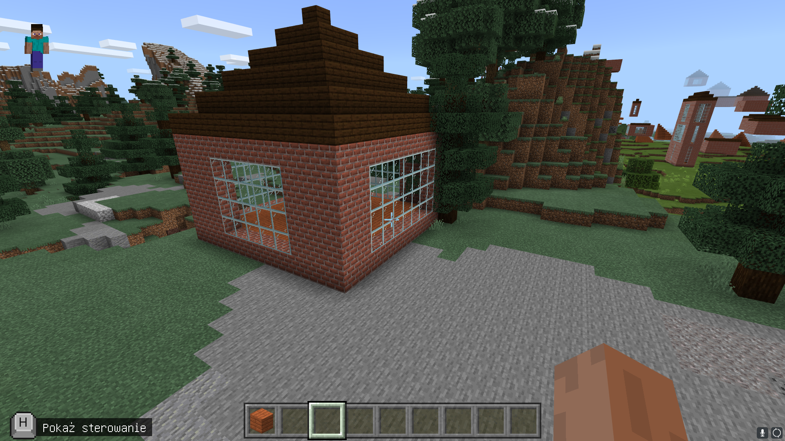
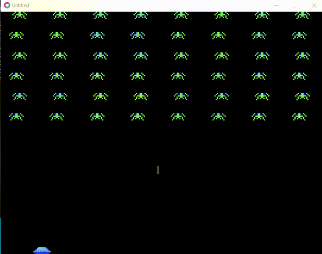

# Języki skryptowe **UJ [Gry komputerowe]**

1. ***Bash*** kółko i krzyżyk ```tic-tac-toe.sh```
2. ***Python*** Arkanoid ```python arkandoid.py```
3. ***Minecraft*** Generator budynku ```minecraft-script.ts```

4. ***Lua LÖVE*** Space Invaders ```love-space-invaders```

