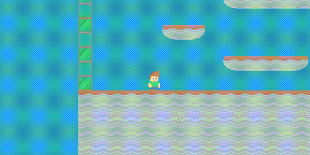

# Języki skryptowe **UJ [Gry komputerowe]**

1. ***Bash*** kółko i krzyżyk ```tic-tac-toe.sh```
2. ***Python*** Arkanoid ```python arkandoid.py```
3. ***Minecraft*** Generator budynku ```minecraft-script.ts```

4. ***Lua LÖVE*** Space Invaders ```love-space-invaders```


4. ***Phaser3*** Runner ```phaser3-runner```
#### Jak uruchomić:
* ```cd phaser3-runner```
* ```npm install```
* ```npm start```

***Wykorzystano Assety ze strony: https://www.kenney.nl/assets***
#### Gra powinna być widoczna na porcie localhost:8000
